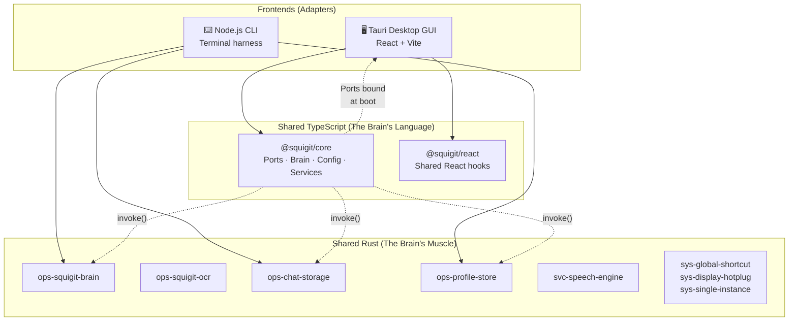
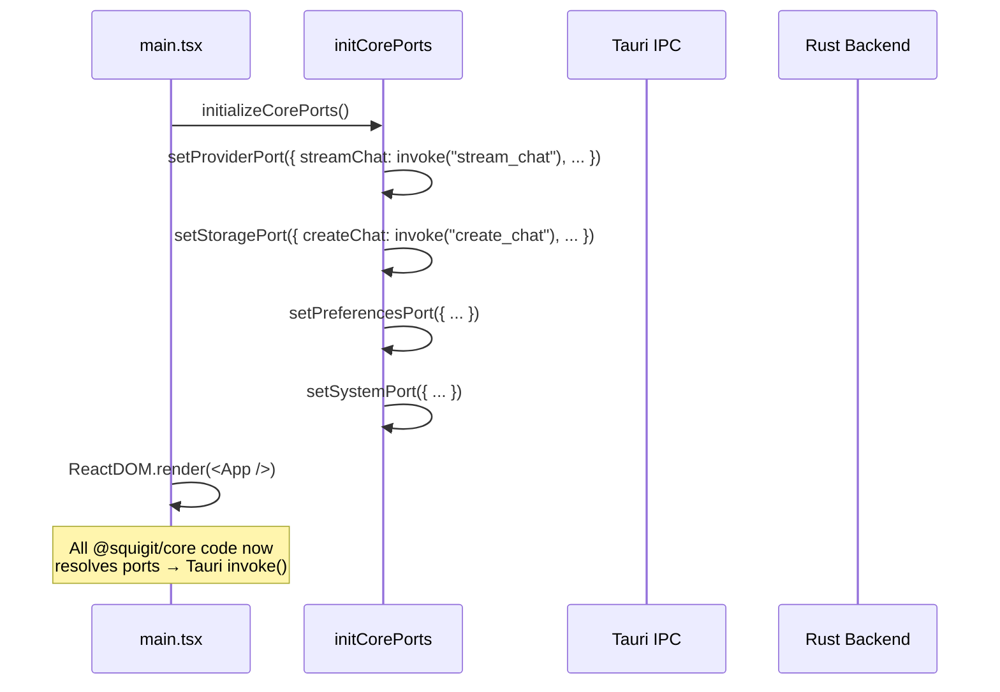
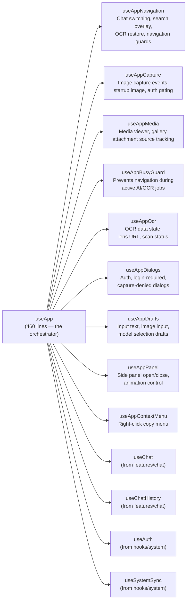
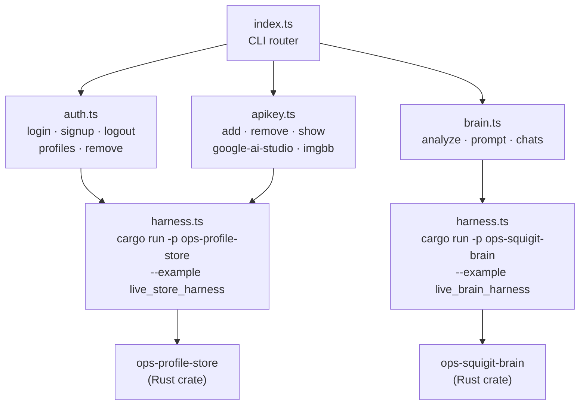

# Squigit Architecture Walkthrough

## What Squigit Is

A **local-first screen analyzer** — you capture/open an image, it analyzes it with AI ("the soul"), then you chat about it with your chosen provider. Key differentiators:

- **Stateless API** — full history is sent on every request, no cloud state
- **Local OCR** — on-CPU text recognition of what you see
- **Built-in Whisper** — voice chat via local speech engine
- **Hexagonal Architecture** — one brain, two faces (GUI + TUI)

---

## The Big Picture



---

## Layer 1: Rust Shared Crates — `crates/`

> [!IMPORTANT]
> These are the **platform-agnostic backend operations**. Both Tauri commands and CLI harnesses call into these same crates.

| Crate                                                                                   | Role                                                                                    |
| --------------------------------------------------------------------------------------- | --------------------------------------------------------------------------------------- |
| [ops-squigit-brain](file:///home/a7md/squigit.org/squigit/crates/ops-squigit-brain)     | AI brain — Gemini streaming, image analysis, title generation, conversation compression |
| [ops-squigit-ocr](file:///home/a7md/squigit.org/squigit/crates/ops-squigit-ocr)         | OCR model management, on-CPU text recognition pipeline                                  |
| [ops-chat-storage](file:///home/a7md/squigit.org/squigit/crates/ops-chat-storage)       | Chat persistence — BLAKE3 image hashing, chat CRUD, OCR frame storage                   |
| [ops-profile-store](file:///home/a7md/squigit.org/squigit/crates/ops-profile-store)     | Profile/auth management — Google OAuth, encrypted key storage, multi-profile            |
| [svc-speech-engine](file:///home/a7md/squigit.org/squigit/crates/svc-speech-engine)     | Whisper integration — local speech-to-text via sidecar process                          |
| [sys-global-shortcut](file:///home/a7md/squigit.org/squigit/crates/sys-global-shortcut) | Cross-platform global hotkey listener                                                   |
| [sys-display-hotplug](file:///home/a7md/squigit.org/squigit/crates/sys-display-hotplug) | Monitor connect/disconnect detection (Windows via `windows-sys`)                        |
| [sys-single-instance](file:///home/a7md/squigit.org/squigit/crates/sys-single-instance) | Single-instance lock via `fs2` file locking                                             |

The naming convention is intentional:

- **`ops-*`** = business operations (the actual product logic)
- **`svc-*`** = service wrappers (external tool integrations)
- **`sys-*`** = system-level concerns (OS integration)

Each crate ships **example harnesses** (e.g. `live_store_harness`, `live_brain_harness`) that the CLI spawns as `cargo run -p <crate> --example <harness>`.

---

## Layer 2: Shared TypeScript — `apps/shared/packages/`

This is the **hexagonal core** on the frontend side. Two packages:

### `@squigit/core` — The Port Interfaces + Pure Logic

```
apps/shared/packages/core/src/
├── ports/           ← THE hexagonal boundary
│   ├── provider.ts  ← AI provider operations
│   ├── storage.ts   ← Chat/image persistence
│   ├── preferences.ts ← User settings I/O
│   └── system.ts    ← OS-level operations
├── brain/           ← Pure business logic
│   ├── engine/      ← Streaming, tool events, message types
│   ├── provider/    ← Provider error handling, retry logic
│   ├── session/     ← Session state, context window, compression
│   └── attachments/ ← File attachment handling
├── config/          ← App settings, chat storage types, model config
├── helpers/         ← Dialogs, error parsing, API status
└── services/        ← Google, GitHub, ImgBB URL builders
```

#### The 4 Ports (this is the architectural crown jewel)

Each port is a **contract interface** + a **module-level singleton** with `set`/`get`:

| Port                                                                                                        | Contract                                                                                                           | What it abstracts    |
| ----------------------------------------------------------------------------------------------------------- | ------------------------------------------------------------------------------------------------------------------ | -------------------- |
| [ProviderPort](file:///home/a7md/squigit.org/squigit/apps/shared/packages/core/src/ports/provider.ts)       | `streamChat`, `generateImageBrief`, `generateChatTitle`, `compressConversation`, `cancelRequest`, `listenToStream` | All AI communication |
| [StoragePort](file:///home/a7md/squigit.org/squigit/apps/shared/packages/core/src/ports/storage.ts)         | `createChat`, `loadChat`, `listChats`, `searchChats`, `appendChatMessage`, `saveOcrData`, `storeImageBytes`        | All data persistence |
| [PreferencesPort](file:///home/a7md/squigit.org/squigit/apps/shared/packages/core/src/ports/preferences.ts) | `hasAgreedFlag`, `readPreferencesFile`, `writePreferencesFile`                                                     | User preferences I/O |
| [SystemPort](file:///home/a7md/squigit.org/squigit/apps/shared/packages/core/src/ports/system.ts)           | `openExternalUrl`, `getApiKey`, `uploadImageToImgBB`, `listenToSystemEvent`                                        | OS/system operations |

> [!TIP]
> The pattern: `setProviderPort(impl)` is called **once at boot** by whatever adapter is running. After that, all `@squigit/core` code just calls `getProviderPort().streamChat(...)` without knowing if it's Tauri `invoke()` or a direct Rust FFI call or anything else.

### `@squigit/react` — Shared React Hooks

```
apps/shared/packages/react/src/
├── brain/hooks/     ← useBrainTitle, etc.
├── attachments/     ← useAttachments
└── services/        ← shared service hooks
```

These hooks are **adapter-agnostic** — they call into `@squigit/core` ports, never into Tauri/Electron directly.

---

## Layer 3a: Desktop GUI — The Tauri Adapter

### Boot Sequence



[main.tsx](file:///home/a7md/squigit.org/squigit/apps/desktop/renderer/src/main.tsx) calls [initializeCorePorts()](file:///home/a7md/squigit.org/squigit/apps/desktop/renderer/src/app/bootstrap/initCorePorts.ts) **before** React renders. This single function is the **adapter binding** — it wires every port to Tauri's `invoke()` IPC.

### Platform Adapter — `platform/tauri/`

| File                                                                                                            | Purpose                                                                                                   |
| --------------------------------------------------------------------------------------------------------------- | --------------------------------------------------------------------------------------------------------- |
| [commands.ts](file:///home/a7md/squigit.org/squigit/apps/desktop/renderer/src/platform/tauri/commands.ts)       | Direct Tauri command wrappers (avatar caching, image processing, auth, profiles, window mgmt, OCR, audio) |
| [events.ts](file:///home/a7md/squigit.org/squigit/apps/desktop/renderer/src/platform/tauri/events.ts)           | Typed event listener for `provider-stream-token` (tokens, tool_start, tool_end, reset)                    |
| [tauri.types.ts](file:///home/a7md/squigit.org/squigit/apps/desktop/renderer/src/platform/tauri/tauri.types.ts) | Shared types: `Profile`, `ImageResponse`, `AppConstants`                                                  |

> [!NOTE]
> `commands.ts` is for **Tauri-specific** operations that don't go through the ports system (window management, UI sounds, avatar caching). The ports handle the core business logic.

### App Hooks — The Composable State Machine

The entire GUI state is composed from **10 specialized hooks**, all orchestrated by [useApp.ts](file:///home/a7md/squigit.org/squigit/apps/desktop/renderer/src/app/hooks/useApp.ts):



Key design decisions:

- **`useAppNavigation`** (463 lines) — the most complex hook. Handles `performSelectChat()` which loads a chat's image, messages, OCR data, and rolling summary in a carefully sequenced `flushSync` dance. Uses `navigationRequestIdRef` to cancel stale navigations.
- **`useAppCapture`** (314 lines) — listens to 6 Tauri events (`image-path`, `load-chat`, `capture-requested`, `capture-complete`, `capture-failed`, `auth-success`). Uses refs for everything to avoid stale closures.
- **`useAppBusyGuard`** — prevents destructive actions (switching chats, new session) while AI is generating or OCR is scanning. Shows a confirmation dialog.

### Provider Architecture

```
AppProvider
├── AppContext (full useApp return — 60+ fields)
├── AppMediaProvider (media viewer slice)
└── AppNavigationProvider (navigation slice)
```

[AppProvider.tsx](file:///home/a7md/squigit.org/squigit/apps/desktop/renderer/src/app/providers/AppProvider.tsx) splits the massive `useApp` return into **focused contexts** via `useMemo` + `Pick<AppState, ...>` to prevent unnecessary re-renders.

[ThemeProvider.tsx](file:///home/a7md/squigit.org/squigit/apps/desktop/renderer/src/app/providers/ThemeProvider.tsx) handles light/dark/system theme with native window background sync via `invoke("set_background_color")`.

### Feature Modules

```
features/
├── chat/      ← useChat, useChatHistory, chat UI components
├── media/     ← Media viewer, gallery
├── ocr/       ← OCR overlay, model management
├── search/    ← Search overlay
└── settings/  ← Settings panel
```

---

## Layer 3b: CLI — The Terminal Adapter

[apps/cli/](file:///home/a7md/squigit.org/squigit/apps/cli) is a **Node.js harness** that shells out to Rust example binaries.

### Architecture



### How CLI Proves the Hex Architecture

The CLI **does not import `@squigit/core`** at all. Instead:

1. [harness.ts](file:///home/a7md/squigit.org/squigit/apps/cli/src/harness.ts) spawns `cargo run` against the same Rust crates the Tauri backend uses
2. Communication is via **stdout JSON** — `parseLastJsonLine<T>()` extracts the last JSON line from cargo output
3. The auth flow uses `runAuthHarnessWithCancellation()` — a sophisticated TTY-aware process with:
   - Inline countdown timer with spinner
   - Raw-mode stdin for Esc/Ctrl+C cancellation
   - SIGINT/SIGTERM forwarding to child process
   - Snapshot/rollback of profile store for login vs signup semantics

### CLI Commands

| Command                       | What it does                                                                       |
| ----------------------------- | ---------------------------------------------------------------------------------- |
| `auth login`                  | Opens browser OAuth, validates account **already exists**, sets active             |
| `auth signup`                 | Opens browser OAuth, validates account is **new**, snapshots + rollback on failure |
| `auth logout`                 | Clears active profile, sets preference to Guest                                    |
| `auth profiles`               | Lists all profiles via harness                                                     |
| `auth remove <id>`            | Deletes profile by ID or email                                                     |
| `api add <provider> <key>`    | Validates key format, encrypts + stores via harness                                |
| `api show <provider>`         | Retrieves decrypted key                                                            |
| `brain analyze <image> [msg]` | Sends image to Gemini, creates chat, returns title + response preview              |
| `brain prompt <chatId> <msg>` | Continues existing chat                                                            |
| `brain chats`                 | Lists all chats for active profile                                                 |

> [!TIP]
> The "my only prove" you mentioned — `brain analyze` in CLI creates a chat → open GUI → chat appears with the image and AI response already there. Same `ops-chat-storage` crate, same filesystem, same data.

---

## The Hex Pattern in Action: Data Flow

Here's what happens when you say "analyze this screenshot" in **both faces**:

````carousel
### GUI Flow
```
User drops image
  → useAppCapture listens to "image-path" event
  → commands.processImagePath() → Tauri invoke
  → ops-chat-storage creates chat (Rust)
  → handleImageReady() sets startup image
  → useChat sends to Gemini via ProviderPort
  → ProviderPort.streamChat() → invoke("stream_chat")
  → ops-squigit-brain streams response (Rust)
  → listenToStream() receives tokens via Tauri events
  → UI renders streaming text
```
<!-- slide -->
### CLI Flow
```
User runs: brain analyze ./screenshot.png "what is this?"
  → brain.ts calls runBrainHarness(["analyze", path, msg])
  → harness.ts spawns: cargo run -p ops-squigit-brain
       --example live_brain_harness -- analyze ./screenshot.png "..."
  → ops-squigit-brain (same crate!) processes image
  → ops-chat-storage (same crate!) creates chat
  → Response printed as JSON to stdout
  → brain.ts parses last JSON line
  → Prints: chat_id, title, response preview
```
````

**Same Rust crates. Same data directory. Different adapters.**

---

## Summary

| Concern                              | Where it lives                                          |
| ------------------------------------ | ------------------------------------------------------- |
| AI streaming, image analysis, titles | `ops-squigit-brain` (Rust) + `@squigit/core/brain` (TS) |
| Chat persistence, image CAS          | `ops-chat-storage` (Rust) + `StoragePort` (TS)          |
| User auth, profiles, encrypted keys  | `ops-profile-store` (Rust)                              |
| OCR pipeline                         | `ops-squigit-ocr` (Rust)                                |
| Speech-to-text                       | `svc-speech-engine` (Rust)                              |
| Port contracts                       | `@squigit/core/ports/` — 4 interfaces                   |
| Port binding (GUI)                   | `initCorePorts.ts` — wires ports → `invoke()`           |
| Port binding (CLI)                   | `harness.ts` — shells out to Rust examples              |
| GUI state machine                    | `useApp.ts` → 10 composable hooks                       |
| CLI command dispatch                 | `index.ts` → 3 command modules                          |

> [!IMPORTANT]
> The architecture is **production-proven**: Tauri ☑️ and CLI ☑️. The ports system means any new frontend (Electron, web, another TUI framework) only needs to implement the 4 port interfaces — zero brain logic changes.
