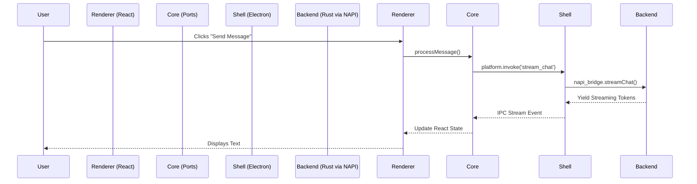

# Squigit Architecture Overview

Squigit is designed as a highly decoupled, cross-platform application that spans across multiple environments: a graphical user interface (GUI) available in both **Tauri** (legacy/archived) and **Electron**, as well as a headless **Command Line Interface (CLI)**.

To achieve feature parity across all environments without duplicating complex logic, Squigit utilizes a **Clean Architecture** (specifically inspired by Hexagonal Architecture/Ports and Adapters). It separates concerns into three distinct layers:

1. **The UI & Abstract Domain Layer** (TypeScript/React)
2. **The Universal Native Backend** (Rust `squigit-*` crates)
3. **The Shell Integration Layer** (Electron, CLI)

## Architecture Tree Snapshot

```text
└── squigit/
    ├── apps/
    │   ├── cli/             (Headless Node.js App)
    │   ├── desktop/         (Electron Shell)
    │   ├── renderer/        (Pure React/Vite Frontend)
    │   └── shared/          (TS Domain Logic & React Hooks)
    │
    └── crates/
        ├── desktop-runtime/ (Shared GUI Runtime)
        ├── global-shortcut/ (OS-level shortcuts)
        ├── napi-bridge/     (FFI Node.js Bridge)
        ├── squigit-auth/    (Profile & Security)
        ├── squigit-brain/   (Gemini Engine)
        ├── squigit-memory/  (Chat Storage)
        ├── squigit-ocr/     (Media Parsing)
        └── squigit-stt/     (Speech-to-Text)
```

---

## 1. The UI & Abstract Domain Layer

The uppermost layer represents the frontend codebase. Its primary responsibility is rendering the user interface and handling React state, remaining entirely oblivious to whether it runs in a browser or a desktop shell.

### `apps/renderer` (The View)
Written in React, TypeScript, and TailwindCSS. This is the pure UI layer. It contains components, animations, and CSS. Because it contains zero native OS calls (like file reading or window management), it can be securely sandboxed and injected into any shell.

### `apps/shared/packages/core` (The Domain & Ports)
This is the platform-agnostic business logic. It handles complex AI conversational state, streaming mechanisms, and prompt generation. Because it is sandboxed TypeScript, it relies on the **"Ports" pattern**:
- Inside `src/ports/`, it defines abstract interfaces (`ProviderPort`, `StoragePort`, `SystemPort`). 
- When the React `renderer` boots up, it resolves an environment-specific alias (`@platform`) driven by Vite.
- The renderer then maps these abstract ports to concrete Inter-Process Communication (IPC) calls. This allows the React app to command the host system to "save a file" or "open a window" without knowing if the host is Electron or Tauri.

---

## 2. The Universal Backend (The Rust Engine)

To guarantee that the CLI and Electron shells behave identically (and perform consistently), all heavy lifting is pushed into a shared Rust backend. 

### `crates/squigit-*` (Business Logic & Core Operations)
Instead of rewriting backend logic in Node.js, Squigit shifts all fundamental application logic into a suite of pure Rust crates:
- **`squigit-brain`**: The core Gemini integration and orchestration logic.
- **`squigit-memory`**: Database management and file storage operations.
- **`squigit-auth`**: Authentication and profile configurations.
- **`squigit-ocr` & `squigit-stt`**: Heavy media processing capabilities.

### `crates/desktop-runtime` (The Shared GUI Runtime)
While the CLI focuses on headless data processing, the GUI shells share "GUI-adjacent" needs—like preparing an image before sending it to the frontend or computing local storage directories. `desktop-runtime` encapsulates this hybrid logic in Rust so it only has to be written once.

---

## 3. The Bridge & IPC Layer

Because the Universal Backend is written in Rust, the Node.js shells need a way to invoke these operations.

### `crates/napi-bridge` (Node.js <-> Rust)
Since Electron's main process and the CLI run in a Node.js V8 environment, they cannot call Rust code directly natively. Squigit solves this via **`napi-bridge`**.
- This crate compiles the Rust backend into a native Node.js Addon (`addon/index.node`).
- When the CLI or Electron requires backend functionality, they import this native bridge, accessing high-performance Rust execution with the convenience of asynchronous JavaScript functions.

---

## 4. The Shell Integration Layer (The Un-Sharable Native Code)

Despite the aggressive sharing of UI components and Rust backend logic, a desktop application must integrate intimately with its host operating system (Windows, macOS, Linux). 

### `apps/desktop` (Electron)
The Electron app uses C++ backed Node APIs to handle OS-level features. Features like **System Tray Icons**, **Global Keyboard Shortcuts**, **Window Transparency**, and **Lifecycle Events** are explicitly implemented natively in the shell. Attempting to manage an Electron Tray Icon via a Rust NAPI bridge is an anti-pattern. By intentionally allowing this thin layer of duplication, Squigit leverages the native strengths of the framework.

### `apps/cli` (Headless Terminal)
The CLI entirely bypasses the GUI, the `renderer`, and the `ports` architecture. It is a headless TypeScript application that directly imports the `napi-bridge` to perform operations like `analyzeImage` or `promptChat` straight from the terminal. 

---

## Architecture Data Flow



*(In the CLI, the process skips the Renderer and Core layers, directly invoking the `napi_bridge` from the terminal arguments).*
