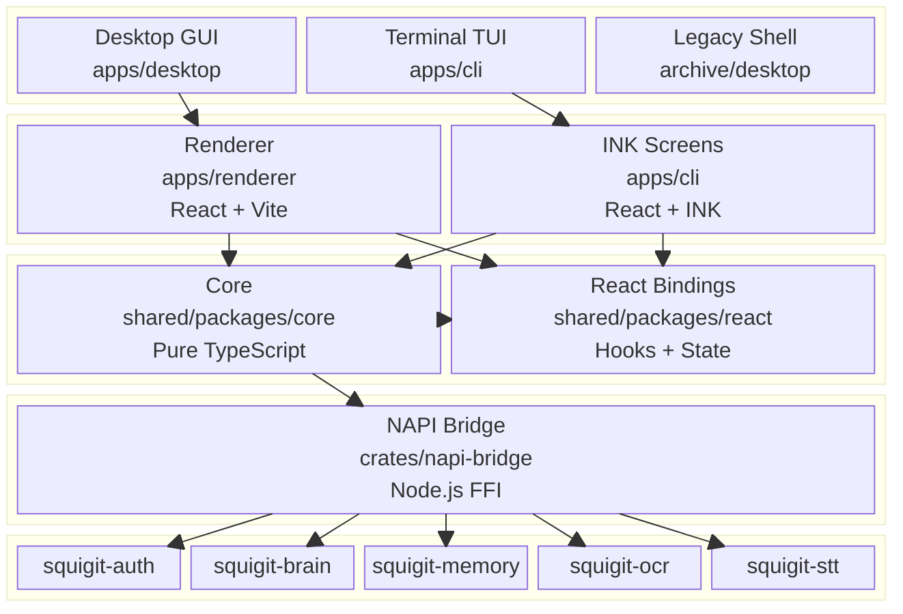
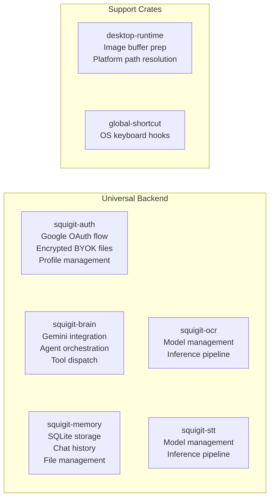
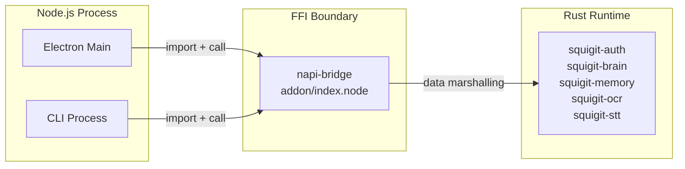
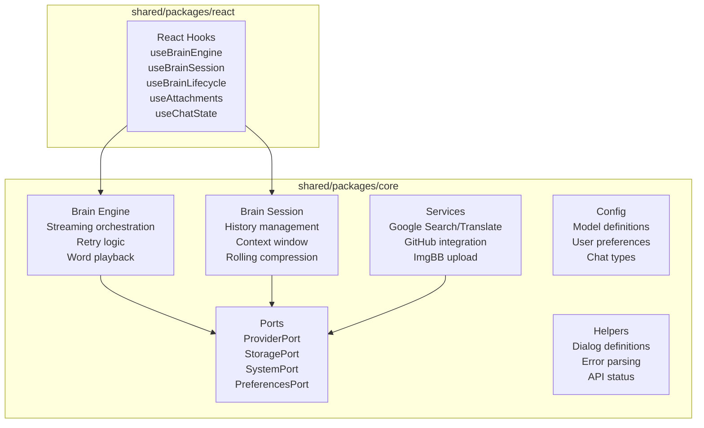
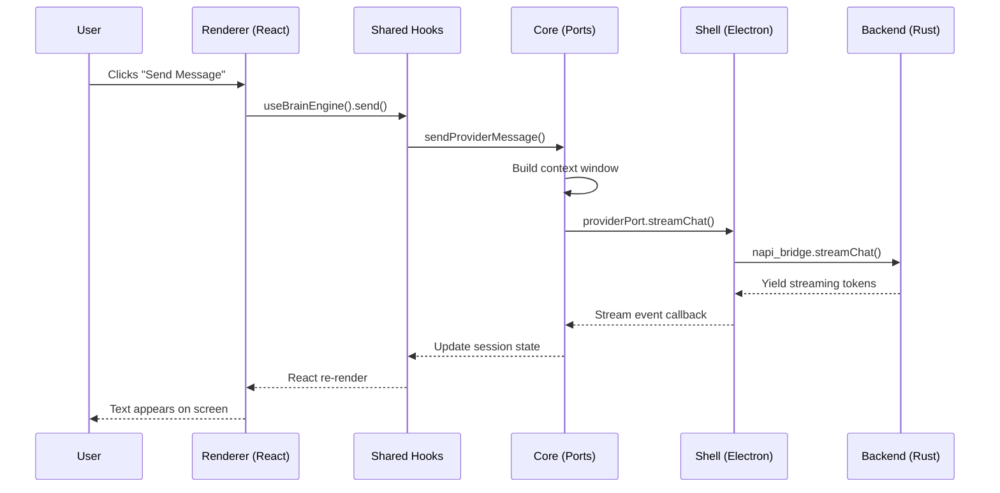
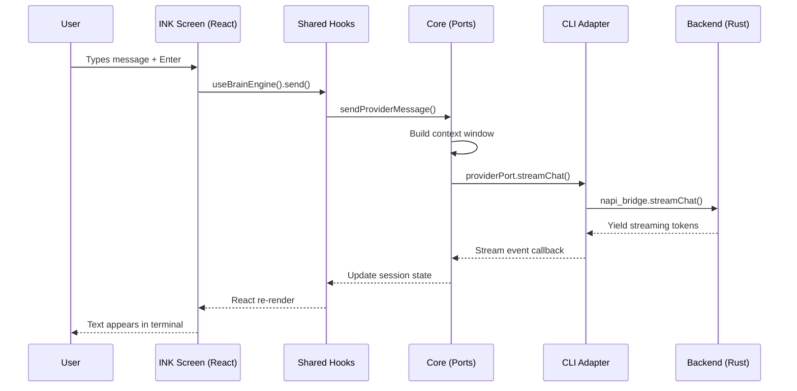
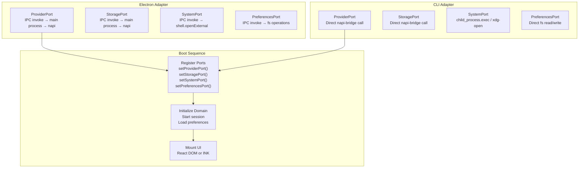

# Squigit Architecture

Squigit is a cross-platform AI assistant. One set of Rust crates handles computation. One set of TypeScript packages handles domain logic. Multiple shells — a desktop GUI, a terminal TUI, and a legacy Tauri build — render the experience. Nothing is duplicated between them.

The design follows **Hexagonal Architecture** (Ports and Adapters). Abstract interfaces define what the system _can_ do. Environment-specific adapters decide _how_ it gets done. The domain logic never learns which shell it runs inside, and it never should.

---

## The Stack



---

## Workspace Layout

```text
squigit/
  apps/
    cli/                Terminal TUI (INK + React)
    desktop/            Electron shell (main process, tray, shortcuts)
    renderer/           GUI frontend (React + Vite + Tailwind)
    shared/
      packages/
        core/           Domain logic, ports, services (pure TypeScript)
        react/          React hooks over domain logic

  crates/
    desktop-runtime/    GUI-specific runtime utilities
    global-shortcut/    OS-level keyboard hooks
    napi-bridge/        Node.js <-> Rust FFI boundary
    squigit-auth/       Google OAuth, profiles, encrypted BYOK credentials
    squigit-brain/      Gemini AI engine, agent orchestration
    squigit-memory/     SQLite storage, chat history, files
    squigit-ocr/        OCR model management and inference
    squigit-stt/        Speech-to-text engine

  archive/
    desktop/            Frozen Tauri v0.1.1 shell
```

---

## Layer by Layer

### Layer 1 — Rust Backend (`crates/`)

All heavy computation lives in Rust. Authentication, AI inference, persistent storage, OCR, and speech-to-text are implemented once and shared across every shell.



| Crate             | What It Owns                                                                                   |
| ----------------- | ---------------------------------------------------------------------------------------------- |
| `squigit-auth`    | Google OAuth sign-in, local profile management, avatar caching, and encrypted per-profile BYOK files |
| `squigit-brain`   | Gemini integration, agent orchestration, tool dispatch                                         |
| `squigit-memory`  | SQLite storage, chat history, file management                                                  |
| `squigit-ocr`     | OCR model management and inference                                                             |
| `squigit-stt`     | Speech-to-text model management and inference                                                  |
| `desktop-runtime` | GUI-specific but shell-agnostic utilities shared between Electron and the archived Tauri shell |
| `global-shortcut` | OS-level keyboard hooks for desktop shells                                                     |

No crate knows which shell called it. None of them should.

---

### Layer 2 — The Bridge (`crates/napi-bridge`)

Electron and the CLI both run in Node.js. They cannot call Rust directly. `napi-bridge` compiles the entire Rust backend into a native Node.js addon (`addon/index.node`).

When any Node.js host needs a backend operation — streaming a chat response, running OCR, loading a profile — it imports the addon and calls it like any async JavaScript function. The bridge marshals data between V8 and Rust. The calling code stays clean.



---

### Layer 3 — Domain Logic (`apps/shared/`)

This is the heart of the application. Two npm packages sit between the Rust backend and any UI surface.

#### `shared/packages/core` — Pure TypeScript

Platform-agnostic business logic: conversation state machines, streaming orchestration, prompt construction, retry policies, provider error handling, rolling summary compression, and title generation. This package has **zero framework imports** — no React, no INK, no DOM. It runs anywhere JavaScript runs.

It communicates with the host through **Ports**: abstract TypeScript interfaces defined in `src/ports/`. Each shell registers its own adapter at startup.

| Port              | Contract                                                                 |
| ----------------- | ------------------------------------------------------------------------ |
| `ProviderPort`    | AI model streaming, title generation, conversation compression           |
| `StoragePort`     | Chat CRUD, image storage, OCR data, rolling summaries                    |
| `SystemPort`      | External URL opening, temp file cleanup, API key retrieval, ImgBB upload |
| `PreferencesPort` | User preferences persistence (theme, model, capture settings)            |

#### `shared/packages/react` — React Bindings

Hooks that wrap the core state machine for any React-based renderer:

- `useBrainEngine` / `useBrainSession` / `useBrainLifecycle` — conversation state and streaming
- `useAttachments` / `useChatState` — media and chat data management
- `useReverseImageSearch` — Google Lens integration

These hooks are framework-agnostic within the React ecosystem. They work identically inside a Vite-bundled browser app and inside an INK terminal process, because both environments are React.



---

### Layer 4 — UI Surfaces

The outermost layer. Each surface renders the user experience using components native to its environment. All domain logic flows through the shared core; the surface only decides _how things look_.

#### `apps/renderer` — Desktop GUI

A React + Vite + Tailwind application. It renders graphical components, manages component state, and nothing else. No direct OS calls, no file I/O, no window management. This constraint lets it be securely sandboxed inside any GUI shell.

At build time, Vite resolves an `@platform` path alias to an environment-specific adapter module. That adapter translates each Port method into the correct IPC call for the active shell (Electron or Tauri). The renderer never needs to know which one.

```text
renderer/src/
  platform/
    electron/    Electron IPC adapter
    tauri/       Tauri command adapter
    types.ts     PlatformBridge interface
    index.ts     @platform alias resolution
  features/
    chat/        Conversation UI
    media/       Image handling
    ocr/         OCR overlays
    search/      Search interface
    settings/    Preferences panels
  components/    Reusable UI primitives
  hooks/         Renderer-specific state
```

#### `apps/cli` — Terminal TUI

An INK + React application. It consumes the same `@squigit/core` domain logic and `@squigit/react` hooks as the desktop GUI, but renders them as terminal components — text boxes, scrollable lists, status bars — instead of browser DOM.

The CLI registers its own Port adapters that call `napi-bridge` directly (no IPC layer needed, since the CLI already runs inside Node.js). From the core's perspective, there is no difference between a chat message sent from a graphical button and one sent from a terminal prompt.

```text
cli/src/
  adapters/      Port implementations (direct napi-bridge calls)
  screens/       INK components (chat, auth, settings)
  commands/      CLI entry points and argument parsing
  addon/         Native napi-bridge binary
```

#### `apps/desktop` — Electron Shell

The Electron app owns the OS-native surface: system tray, global shortcuts, window lifecycle, and transparency. These capabilities are not routed through `napi-bridge` — wiring OS UI events through a Rust layer would be unnecessary indirection.

The shell is intentionally thin. It sets up the native surface, loads the renderer into a `BrowserWindow`, and forwards IPC calls to the Rust backend via the bridge.

```text
desktop/src/
  main.ts        Electron main process
  preload.ts     Context bridge for renderer
  ipc.ts         IPC handler registration
  protocol.ts    Custom protocol for local assets
```

---

## Data Flow

### Desktop GUI



### Terminal TUI



The two diagrams are nearly identical. The only difference is the adapter layer — Electron IPC versus direct NAPI calls. The domain path through Hooks, Core, and Ports is the same.

---

## Port Adapter Wiring

Each shell boots by registering its Port implementations before any domain code runs.



The core calls `getProviderPort().streamChat()`. It has no idea whether that call crosses an IPC boundary or stays in-process. That is the point.

---

## Why This Split Exists

The architecture solves a specific problem: the backend is not the whole application.

Rust handles the _infrastructure_ — authentication, AI inference, storage, media processing. But between that infrastructure and the pixels on screen, there is a thick layer of _application logic_ — conversation state machines, streaming playback timing, retry policies, context window construction, provider error recovery, title generation, and user preference management.

Without the shared packages, every surface would reimplement that logic from scratch. The desktop GUI would have its own streaming orchestrator. The terminal TUI would have its own retry loop. Both would diverge over time.

Isolating this layer into `shared/packages/core` (pure TypeScript) and `shared/packages/react` (React hooks) means the only code a new surface needs to write is Port adapters and visual components. The conversation engine, the state machine, and the business rules come for free.
