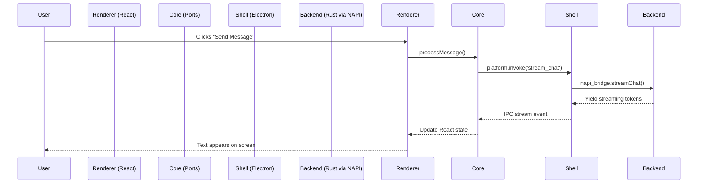

# Squigit Architecture

Squigit is a cross-platform AI assistant built on a strict separation of concerns. The same core logic powers three distinct environments — a desktop GUI (Electron), a headless CLI, and a legacy Tauri build — without duplicating any of it.

The design follows **Hexagonal Architecture** (Ports and Adapters): abstract interfaces define what the system _can_ do, and environment-specific adapters decide _how_ it gets done. This keeps the React frontend and Rust backend completely ignorant of which shell they're running inside.

---

## Layers at a Glance

```text
└── squigit/
    ├── apps/
    │   ├── cli/             Headless Node.js app
    │   ├── desktop/         Electron shell
    │   ├── renderer/        Pure React/Vite frontend
    │   └── shared/          TS domain logic & React hooks
    │
    └── crates/
        ├── desktop-runtime/ Shared GUI runtime
        ├── global-shortcut/ OS-level keyboard hooks
        ├── napi-bridge/     Node.js ↔ Rust FFI bridge
        ├── squigit-auth/    OAuth & credential storage
        ├── squigit-brain/   Gemini AI engine
        ├── squigit-memory/  Chat & file storage
        ├── squigit-ocr/     OCR / media parsing
        └── squigit-stt/     Speech-to-text
```

---

## Layer 1 — UI & Domain (`apps/`)

### `apps/renderer` — The View

A pure React + TypeScript + Tailwind application. It renders UI, manages component state, and nothing else. It makes no direct OS calls — no file I/O, no window management — which means it can be securely sandboxed inside any shell without modification.

### `apps/shared/packages/core` — Domain & Ports

This is where the platform-agnostic business logic lives: AI conversation state, streaming orchestration, and prompt construction. Because this code can't — and shouldn't — know whether it's running inside Electron, Tauri, or a browser, it communicates with the host through **Ports**: abstract TypeScript interfaces defined in `src/ports/`.

| Port           | Responsibility                                  |
| -------------- | ----------------------------------------------- |
| `ProviderPort` | AI model communication                          |
| `StoragePort`  | Reading and writing persistent data             |
| `SystemPort`   | OS operations (opening files, spawning windows) |

At build time, Vite resolves an `@platform` path alias to an environment-specific adapter. Those adapters translate each port method into the correct IPC call for the active shell. The domain layer never needs to know the difference.

---

## Layer 2 — Universal Backend (`crates/squigit-*`)

All heavy computation lives in Rust. Rather than rewriting backend logic per shell, Squigit centralises everything into a suite of pure Rust crates that any host can call.

| Crate            | Responsibility                                         |
| ---------------- | ------------------------------------------------------ |
| `squigit-brain`  | Gemini integration, agent orchestration, tool dispatch |
| `squigit-memory` | SQLite storage, chat history, file management          |
| `squigit-auth`   | OAuth flows, keychain integration, profile config      |
| `squigit-ocr`    | OCR model management and inference                     |
| `squigit-stt`    | Speech-to-text model management and inference          |

`crates/desktop-runtime` is a smaller companion crate for logic that is GUI-specific but still shell-agnostic — preparing image buffers before they reach the renderer, resolving platform storage paths, and so on. It's shared between Electron and the archived Tauri shell so neither has to reimplement it.

---

## Layer 3 — The Bridge (`crates/napi-bridge`)

Electron's main process and the CLI both run in Node.js. They can't call Rust directly, so `napi-bridge` acts as the seam between the two runtimes.

The crate compiles the Rust backend into a native Node.js addon (`addon/index.node`). When Electron or the CLI needs a backend operation — streaming a chat response, running OCR, loading a profile — they import this addon and call it like any async JavaScript function. The bridge handles data marshalling between V8 and Rust; the calling code stays clean.

---

## Layer 4 — Shell Integration (`apps/desktop`, `apps/cli`)

Some things can't be abstracted away. A real desktop app needs to control its tray icon, respond to global keyboard shortcuts, and manage window transparency — all of which require direct integration with the host OS.

### `apps/desktop` — Electron Shell

The Electron app owns the OS-native surface: system tray, global shortcuts, window lifecycle, and transparency. These are not routed through `napi-bridge`, because wiring OS UI events through a Rust layer would be unnecessary indirection. The shell is intentionally thin: it sets up the native surface, loads the renderer, and forwards IPC calls to the Rust backend via the bridge.

### `apps/cli` — Headless Terminal

The CLI skips the renderer, the ports, and the IPC layer entirely. It's a TypeScript application that imports `napi-bridge` directly and invokes backend operations — `analyzeImage`, `promptChat` — straight from parsed terminal arguments. It's useful for scripting and for testing the backend in isolation.

---

## Data Flow



In the CLI, the Renderer, Core, and Shell layers are all bypassed — terminal arguments map directly to `napi_bridge` calls.
